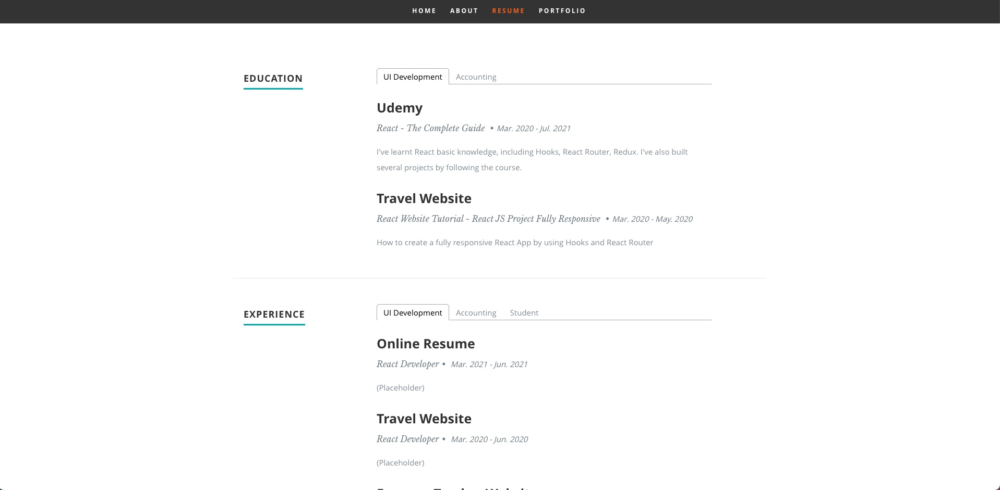
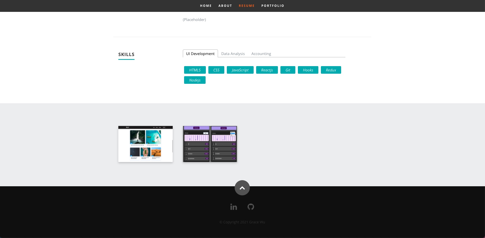
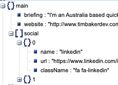
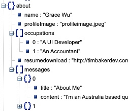
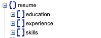
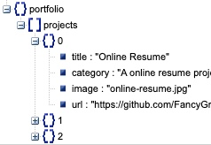
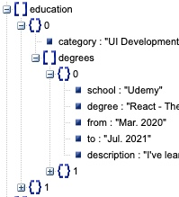
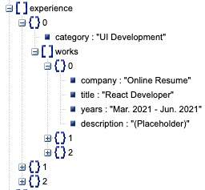
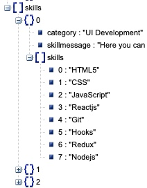
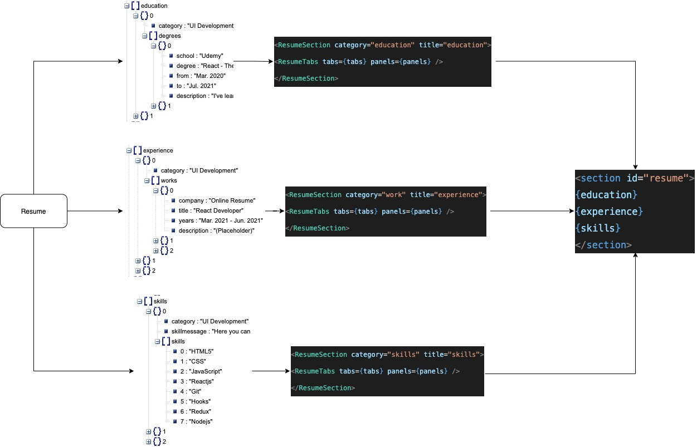

# Online Resume

This is a online resume project without any hardcoded data of candidate. 

  

| Home | About |
| :---: | :---: |
|||
| Resume | Portfolio |
|||

### Description 

This project was bootstrapped with [Create React App](https://github.com/facebook/create-react-app). The project has no hardcoded text in the source code, all the data in views is driven by the local json file `resumeData.json`.

### Data Strcture

`resumeData.json` has a bit complicate data structure because it contains very rich information about the candidate. It includes `main`, `about`, `resume` and `portfolio`.   

|main|about|resume|portfolio|
| :---: | :---: | :---: | :---: |
|||||

The most complicated part would be `resume` part because it supports multiple tabs with different data and styles, including ***education***, ***experience*** and ***skills***.

|education|experience|skills|
| :---: | :---: | :---: |
||||

### Architecture

As I mentioned above, parsing and composing `resume` section is not straightforward. For a better reusability and readability, I've made two reusable components `ResumeSection` and `ResumeTabs` to support a general content with tabs and panels. Then I parsed needed data from `resume` and mapped   them to this ***`<ResumeSection ...><ResumeTabs ...></ResumeSection>`***

### Reference

This project is refering to https://github.com/tbakerx/react-resume-template. I've cloned and refactor the project and made some changes to fit my needs.  
